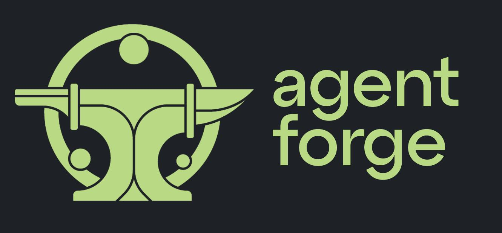

[](https://github.com/DataBassGit/AgentForge/blob/dev/LICENSE)
[](https://pypi.org/project/agentforge/)
[](https://github.com/DataBassGit/AgentForge/tree/dev/docs)
[](https://www.python.org/)
[](https://agentforge.net/)



# AgentForge

**AgentForge** is a low-code framework designed for rapid development, testing, and iteration of AI-powered autonomous agents and cognitive architectures. Compatible with a range of LLM models—including OpenAI, Google's Gemini, Anthropic's Claude, and local models via [Ollama](https://ollama.com) or [LMStudio](https://lmstudio.ai)—it offers the flexibility to run different models for different agents based on your specific needs.

Whether you're a newcomer seeking an easy entry point or a seasoned developer aiming to build complex cognitive architectures, **AgentForge** provides the tools you need to craft intelligent, model-agnostic, and database-flexible autonomous agents.

---

## Table of Contents

1. [Features](#features)
2. [Installation and Quick Start](#installation-and-quick-start)
3. [Documentation](#documentation)
4. [Contributing](#contributing)
5. [Contact Us](#contact-us)
6. [License](#license)

---

## Features

Easily build agents or cognitive architectures (multi-agent scripts) with the following **AgentForge** functionality:

- **Customizable Agents**: Tailor agents to fit your specific use cases with ease.
- **Custom Tools & Actions**: Extend functionality by creating custom tools and actions.
- **Dynamic Prompt Templates**: Utilize flexible prompt templates that adapt to various contexts.
- **LLM Agnostic Agents**: Run different agents with different LLMs as per your requirements.
- **On-The-Fly Prompt Editing**: Modify prompts in real-time without restarting the system.
- **OpenAI, Google & Anthropic API Support**: Seamlessly integrate with popular LLM APIs.
- **Open-Source Model Support**: Leverage local models through [Ollama](https://ollama.com) and [LMStudio](https://lmstudio.ai).

---

## Installation and Quick Start

Get started with **AgentForge** in just a few steps:

1. **Install AgentForge via pip**:

   ```bash
   pip install agentforge
   ```

2. **Set Up Environment Variables**:

   - For OpenAI:

     ```bash
     export OPENAI_API_KEY='your-openai-api-key'
     ```

   - For Anthropic:

     ```bash
     export ANTHROPIC_API_KEY='your-anthropic-api-key'
     ```

3. **Run a Basic Agent**:

   ### 1. Define the Agent Class

   Create a Python file named `echo_agent.py` in your project root:

   ```python
   from agentforge import Agent
   
   class EchoAgent(Agent):
       pass  # The agent_name is automatically set to 'EchoAgent'
   ```
   
   ### 2. Create the Prompt Template (`EchoAgent.yaml`)

   Inside the `.agentforge/prompts/` directory, create a **YAML** file named `EchoAgent.yaml`:

   ```yaml
   Prompts:
     System: You are an assistant that echoes the user's input.
     User: {user_input}
   ```

   ### 3. Write a Script to Run the Agent

   Create a separate Python script (e.g., `run_agent.py`) in your project root to import and run your custom agent:

   ```python
   from echo_agent import EchoAgent

   # Initialize the agent
   agent = EchoAgent()

   # Run the agent with an input message
   response = agent.run(user_input="Hello, AgentForge!")
   print(response)
   ```

   ### 4. Execute the Script

   Ensure your virtual environment is activated and run the script:

   ```bash
   python run_agent.py
   ```

   ### 5. **Example Response**

   Assuming the agent is connected to an LLM, the output might be:

   ```
   Hello, AgentForge!
   ```

>*Note: The actual response will depend on the LLM used and its configuration. This is just a very crude example.*

---

## Documentation

Welcome to the **AgentForge** framework documentation. This comprehensive guide supports you whether you're just getting started or diving deep into custom configurations and advanced features.

### **Getting Started**

- **[Installation Guide](docs/Guides/InstallationGuide.md)**: Step-by-step instructions to install **AgentForge**.
- **[Prerequisites Guide](docs/Guides/PrerequisitesGuide.md)**: Details all pre-installation requirements and dependencies.
- **[Using AgentForge](docs/Guides/UsingAgentForge.md)**: Learn how to run agents, create custom agents, and build cognitive architectures with examples.
- **[Troubleshooting Guide](docs/Guides/TroubleshootingGuide.md)**: Find solutions to common issues and platform-specific problems.

### **Core Concepts**

- **[Agents](docs/Agents/Agents.md)**: Dive deep into the world of agents. Learn how they operate, respond, and can be customized.
- **[LLM API Integration](docs/LLMs/LLMs.md)**: Understand how **AgentForge** connects with various Large Language Model (LLM) APIs.
- **[Personas](docs/Personas/Personas.md)**: Utilize personas to encapsulate information accessible to the agents, acting as a resource of knowledge.
- **[Settings](docs/Settings/Settings.md)**: Delve into the model, storage, and system configurations to tweak the behavior of the system.
- **[Tools & Actions](docs/ToolsAndActions/Overview.md)**: Discover the system's toolbox and learn how to choreograph tools into actionable sequences.
- **[Utilities](docs/Utils/UtilsOverview.md)**: Explore utility functions and tools that enhance the system's capabilities.


---

## Contributing

Feel free to open issues or submit pull requests with improvements or bug fixes. Your contributions are welcome!

### Special Note
We're on the lookout for a UI/UX collaborator who's passionate about open-source and wants to help develop a front-end for this framework. This isn't a job offer, but rather an invitation to be a part of something cool. Interested? We'd love to chat! (See the [Contact Us](#contact-us) section below for details.)

---

## Contact Us

If you're keen on contributing or just want to reach out, here's how to get in touch:

- **Email**: contact@agentforge.net
- **Discord**: Join our [Discord Server](https://discord.gg/ttpXHUtCW6)

---

## License

This project is licensed under the **GNU General Public License v3.0**. See [LICENSE](LICENSE) for more details.