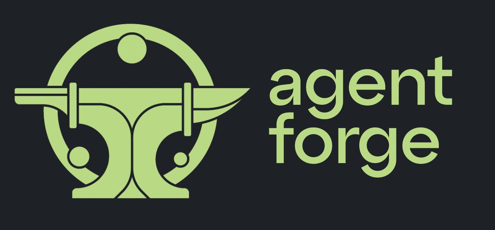

# AgentForge

**AgentForge** is a low-code framework for rapid development, testing, and iteration of AI-powered autonomous agents and cognitive architectures. Its core concepts - flexible **Agents**, declarative **Cogs**, and optional **Memory** - support both simple first runs and sophisticated multi-agent orchestration.

Compatible with a range of LLM models—including OpenAI, Google's Gemini, Anthropic's Claude, and local models via [Ollama](https://ollama.com) or [LMStudio](https://lmstudio.ai)—AgentForge lets you run different models for different agents as needed.

If you are new to AgentForge, start with the beginner path below before opening schemas, memory, storage, subclassing, utilities, or legacy Tools/Actions references.

---

## Table of Contents

1. [Start Here](#start-here)
2. [Features](#features)
3. [Documentation](#documentation)
4. [Contributing](#contributing)
5. [Contact Us](#contact-us)
6. [License](#license)

---

## Start Here

Follow this public docs path in order:

1. **[Quickstart](docs/guides/quickstart.md)**: Install AgentForge, scaffold `.agentforge/`, and understand the no-credential debug-mode first-run boundary.
2. **[First Real Model Run](docs/guides/first_real_model_run.md)**: Learn when credentials or local model services become necessary.
3. **[Core Concepts](docs/guides/core_concepts.md)**: Understand Agents, prompt templates, settings, and Cogs without starting from schema details.
4. **[Beginner Cog Walkthrough](docs/guides/beginner_cog_walkthrough.md)**: Run a small no-memory multi-agent workflow.
5. **[Branch/Loop Cog Walkthrough](docs/guides/branch_loop_cog_walkthrough.md)**: Add a decision branch, revision loop, fallback, and loop guard.
6. **[Advanced Reference](docs/guides/advanced_reference.md)**: Continue into memory, personas, storage, custom APIs, custom Agents, utilities, and legacy Tools/Actions after the beginner workflow is clear.

The **[Using AgentForge](docs/guides/using_agentforge.md)** guide is now the beginner workflow hub that connects those steps.

---

## Features

Build agents and cognitive architectures (multi-agent systems) with:

- **Declarative Cogs**: Orchestrate multi-agent workflows, branching logic, and memory using simple YAML files. Cogs are the primary way to compose agents into complex, reusable workflows.
- **Customizable Agents**: Define agents using YAML prompt templates and configuration.
- **Integrated Memory**: Add contextual memory to agents and cogs for coherent, context-aware interactions. Memory nodes are declared in Cogs and made available to agents automatically.
- **Personas**: Configure agent identity, style, and context using persona YAML files.
- **Dynamic Prompt Templates**: Use flexible prompt templates that adapt to various contexts and memory.
- **LLM Agnostic**: Run different agents with different LLMs as needed.
- **On-The-Fly Prompt Editing**: Modify prompts in real-time without restarting the system.
- **OpenAI, Google & Anthropic API Support**: Integrate with popular LLM APIs.
- **Open-Source Model Support**: Leverage local models through [Ollama](https://ollama.com) and [LMStudio](https://lmstudio.ai).

---

## Documentation

### **Beginner Path**

- **[Docs Landing](docs/README.md)**: Beginner-first public documentation map.
- **[Quickstart](docs/guides/quickstart.md)**: First setup path, including `.agentforge` discovery and debug-mode boundaries.
- **[First Real Model Run](docs/guides/first_real_model_run.md)**: Credential and local-provider boundary for the first real call.
- **[Core Concepts](docs/guides/core_concepts.md)**: Plain-language mental model before reference details.
- **[Beginner Cog Walkthrough](docs/guides/beginner_cog_walkthrough.md)**: The next step after a direct Agent run.
- **[Branch/Loop Cog Walkthrough](docs/guides/branch_loop_cog_walkthrough.md)**: A beginner decision branch, revision loop, fallback, and `max_visits` example.

### **Reference And Advanced Topics**

- **[Agents Reference](docs/agents/agents.md)**: Agent lifecycle, prompts, and advanced subclassing links.
- **[Cogs Reference](docs/cogs/cogs.md)**: Cog schema, transitions, branching, return values, and memory configuration.
- **[Settings Reference](docs/settings/settings.md)**: Model, system, and storage settings.
- **[APIs Reference](docs/apis/apis.md)**: Provider integration and advanced custom API hooks.
- **[Memory](docs/memory/memory.md)** and **[Personas](docs/personas/personas.md)**: Optional advanced context systems.
- **[Storage](docs/storage/chroma_storage.md)**, **[Utilities](docs/utils/utils_overview.md)**, and **[Tools & Actions](docs/tools_and_actions/overview.md)**: Advanced or compatibility material.

---

## Contributing

We welcome issues and pull requests with improvements or bug fixes!

### Special Note
We’re looking for a volunteer UI/UX collaborator—ideally someone who’s genuinely passionate about open-source—to help us develop a front-end for **AgentForge**. To be clear, this isn’t a paid position or formal job; we’re just a couple of backend folks looking to team up with someone interested in contributing their front-end skills for the love of the project and learning together. If you’re interested in collaborating, see [Contact Us](#contact-us) below.

---

## Contact Us

- **Email**: contact@agentforge.net
- **Discord**: Join our [Discord Server](https://discord.gg/ttpXHUtCW6)

---

## License

This project is licensed under the **GNU General Public License v3.0**. See [LICENSE](LICENSE) for more details.
