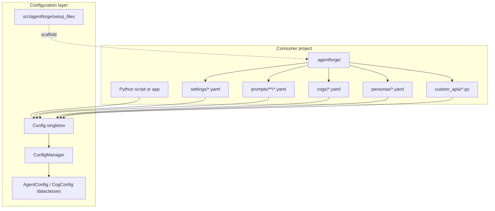
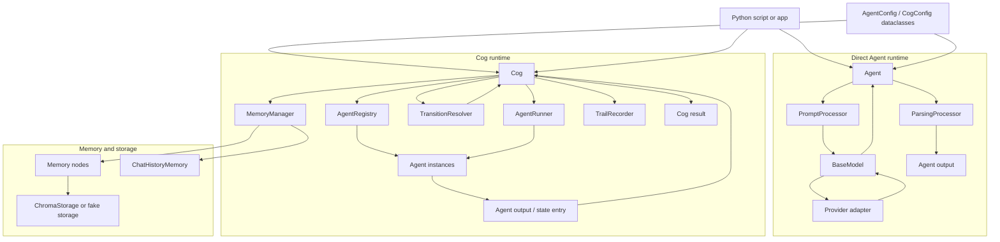

# Pipeline And Configuration Graph

This page gives a timeless map of how AgentForge components fit together. It is for maintainers and agents, not user-facing package docs.

## High-Level Flow

AgentForge turns consumer-owned `.agentforge/` YAML resources into runtime objects. `Config` loads raw resources, `ConfigManager` validates and normalizes them, Agents and Cogs execute the configured work, providers generate model outputs, and parsing/memory utilities shape the result.

There are two primary execution paths:

- Direct Agent execution, where one configured agent renders prompts, calls a model, parses output, and returns a result.
- Cog execution, where a declarative flow coordinates multiple agents, memory nodes, transition rules, and final result extraction.

The framework should stay responsible for reusable orchestration mechanics. Applications should stay responsible for their prompts, workflow purpose, credentials, persona content, and persisted data policy.

## Component Maps

These diagrams are component maps, not exact call-order traces. They separate configuration ingestion from runtime execution so each view stays readable.

### Resource And Configuration Map

### Runtime Execution Map

## Data Ownership

Runtime context enters through `Agent.run(**kwargs)` or `Cog.run(**kwargs)`. Cog passes the external context as `_ctx`, accumulated agent outputs as `_state`, and memory node stores as `_mem`.

Prompt templates consume that data through placeholder rendering. Model providers should receive only the rendered prompt and provider parameters they support. Parsed outputs become agent outputs, Cog state entries, memory updates, or final Cog results depending on configuration.

Memory reads and writes should stay explicit in Cog YAML through `query_before`, `query_keys`, `update_after`, and `update_keys`. Avoid hidden memory side effects in agents unless a subclass documents that behavior.

## Change Guidance

- Config-schema changes should begin at dataclasses and `ConfigManager`.
- Provider changes should stay behind `BaseModel` and provider subclasses.
- Cog routing changes should live in `TransitionResolver` unless they are product-specific and belong in YAML/agent output.
- Memory behavior changes should preserve clear consumer ownership of data, filters, retention, and authority.
- Prompt/parsing changes should include focused tests with realistic model output shapes.
