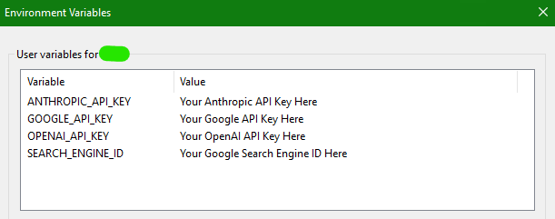
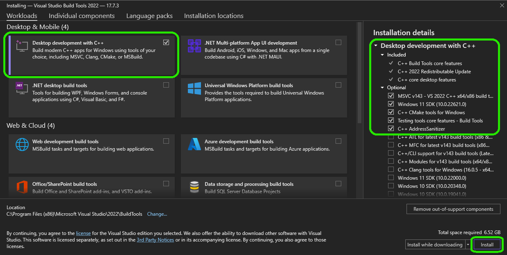
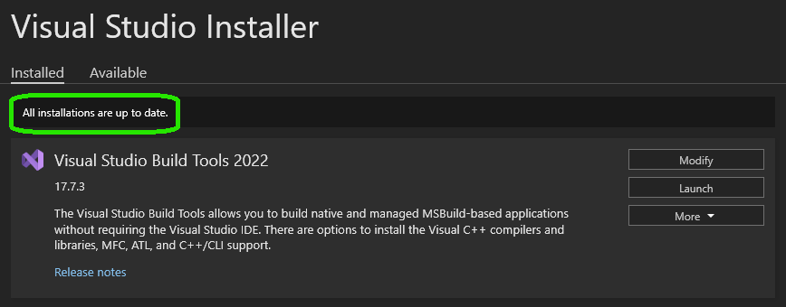

# AgentForge Installation and Usage Guide

---

## Pre-Installation

Before you get started with AgentForge, there are a few things you should know:

### LLM Models
- **Local:** AgentForge can run using self-hosted models via the Oobabooga implementation. You'll need to host the model either locally yourself or on a cloud server as the Oobabooga implementation in AgentForge only handles the connection to the server created by Oobabooga; **it doesn't download or install any models.**
- **Cloud-Based:** To use cloud-based LLM models like OpenAI, you'll need to obtain and set up API keys in your user environment variables.

### LLM API Keys
- You don't need API keys for both Claude and OpenAI if you plan on using just one. No API keys are needed if you're using the Oobabooga implementation. The model you wish to use can be specified in the [Model Configuration](../../docs/Settings/Models.md) file.

### Other Services
- If you're planning to use Google Search functionalities, you'll need both a Google API key and a Google Search Engine ID key.

### Environment Variables
Set your **User Environment Variables** names to the following:

- **Claude**: ANTHROPIC_API_KEY 
- **OpenAI**: OPENAI_API_KEY
- **Google**: GOOGLE_API_KEY
- **Google Search Engine ID**: SEARCH_ENGINE_ID



### 3rd-Party API Documentation
- We haven't provided guides for obtaining these API keys as it's outside the scope of this project. Plenty of resources are available online to guide you through the process.

### Microsoft C++ Build Tools (WINDOWS ONLY)

**Note**: If you already have all the Microsoft C++ Build Tools below, you can skip ahead to the [Installation](#installation-guide-for-agentforge) section.

1. [ChromaDB](https://www.trychroma.com/) requires [Microsoft C++ Build Tools](https://visualstudio.microsoft.com/visual-cpp-build-tools/) in order to work with Windows.
2. Once downloaded, mark the 'Desktop Development with C++' for installation. It should automatically select these optional packages for you.
   
3. When the installation is complete, you'll see a message that says, 'All installations are up-to-date.'
   
4. Done! Close the Visual Studio installer.


---

## Installation Guide for AgentForge

Follow these steps to install and set up AgentForge:

### Prerequisites
Ensure your system has Python 3 and pip installed:
```shell
sudo apt-get update
sudo apt-get install python3 python3-pip
```

### Installation Steps

1. **(Optional) Set Up a Virtual Environment**:
   It's recommended to use a virtual environment to avoid conflicts with system-wide packages.
   - Install the virtual environment package if you haven't already:
     ```shell
     sudo pip3 install virtualenv
     ```
   - Create and activate a virtual environment (replace `my_project` with your desired directory):
     ```shell
     mkdir my_project
     cd my_project
     virtualenv venv
     source venv/bin/activate
     ```

2. **Install AgentForge**:
   Navigate to your project directory and install AgentForge using pip:
   ```shell
   pip install .agentforge
   ```

3. **Initialize Your Bot Project**:
    Initialize your AgentForge project:
   ```shell
   .agentforge init
   ```

4. **(Optional) Try the Demo Architecture**:
   To experiment with the demo bot architecture, run:
   ```shell
   .agentforge salience
   ```

When you're done working in the virtual environment, deactivate it with `deactivate`. Remember to activate the virtual environment (`source venv/bin/activate`) whenever you return to work on your project.

---

## Dev-build Installation

If you want to install the build from the dev branch and help with development, follow these instructions instead:

Clone the GitHub repository:

```shell
git clone https://github.com/DataBassGit/AgentForge.git
cd .agentforge
pip install -e
```

---

## Usage

Each Cognitive Architecture (bot) you create should contain an `.agentforge` folder which contains everything pertaining to its agents and personas along with other configuration files.

**Important**: Before running any bot, we need to make sure that the configuration files have the correct LLM settings. If you've selected an OpenAI model, for example, the system will look for the corresponding API key in your environment variables. This applies not only to the default settings but also to individual [Custom Agents](../../docs/Agents/CustomAgents.md) as they can override these settings and call different models if needed.

>**Note**: We define `Cognitive Architectures` or `Bots` as Multi-Agent Scripts!  

### For Custom Agents

To get started with custom agents, navigate to `Examples/CustomAgents/`. Inside, you'll find the `.agentforge/` folder with its configuration files as well as an `agents` folder which contains an example of a custom test agent. To know more about how to use and create your own agents, check out the [Custom Agents](../../docs/Agents/CustomAgents.md) page.

### For Salience Bot Example

If you've installed our Salience example, head over to `Examples/SalienceBot/.agentforge/` to find its configuration files.

To run the Salience Bot demo, go to `Examples/SalienceBot/` in your console and run:

```shell
python salience.py
```

This will execute a simple bot script that uses our
[Predefined Agents](../../docs/Agents/PredefinedAgents/PredefinedAgents.md) 
to complete an objective by breaking it down into tasks, subsequently executing them and checking for completion.

For a deep dive into our `Salience` example please refer to the [Salience Code](../../src/agentforge/utils/installer/salience.py)
(Note: There is no Documentation for Salience Bot Yet)

**Important** : Whenever a bot runs, it will first initialize ChromaDB (or whichever database is used) as it will act as the memory for the agents. The first time Chroma is initialized on a system it needs to download a few language models for sentence embedding, so it is normal for it to take several minutes to run the first time. Any subsequent runs will not have this issue as long as Chroma has previously downloaded the models being used.