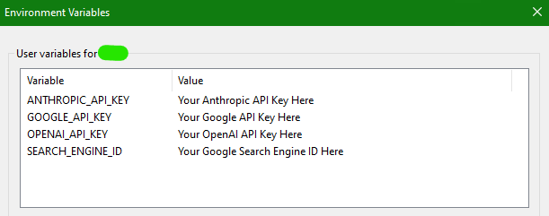
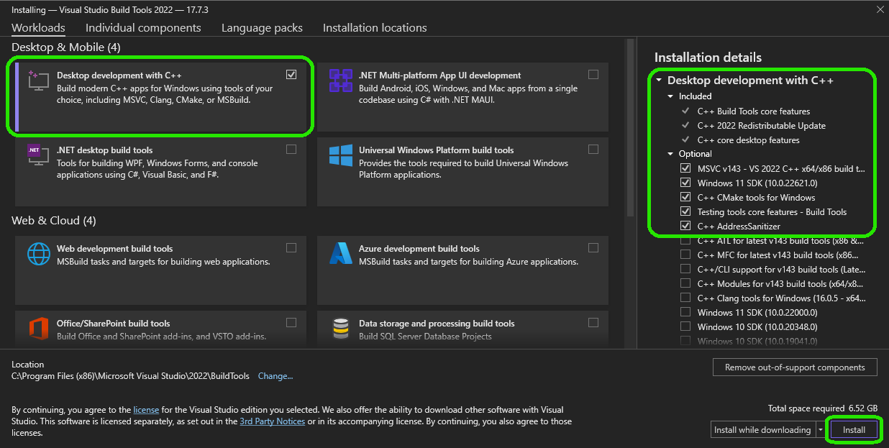
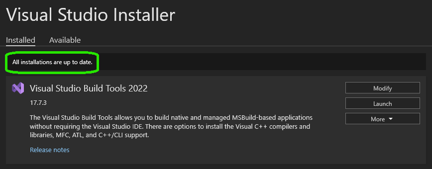

# AgentForge Prerequisites Guide

Before you begin using **AgentForge**, ensure your system meets the necessary requirements and configurations.

---

## Python Version Requirement

- **Python 3.11**
- Verify your Python version:

  ```shell
  python3 --version
  ```

---

## API Keys and Environment Variables

**AgentForge** supports both cloud-based and local Large Language Models (LLMs).

### Cloud-Based LLMs

To use cloud-based models like OpenAI, Anthropic, or Google, you need to obtain API keys.

#### **Supported Cloud-Based LLMs**:

- **OpenAI**
- **Anthropic**
- **Google**

#### **Obtaining API Keys**:

- **OpenAI**: Sign up at [OpenAI](https://openai.com/) and obtain an API key.
- **Anthropic**: Visit [Anthropic](https://www.anthropic.com/) for API access.
- **Google**: Access the [Google Cloud Platform](https://cloud.google.com/) to obtain API keys.

#### **Setting Environment Variables**:

Set your environment variables to store your API keys securely.

- **OpenAI**: `OPENAI_API_KEY`
- **Anthropic**: `ANTHROPIC_API_KEY`
- **Google**: `GOOGLE_API_KEY`

##### **On Unix/macOS**:

```shell
export OPENAI_API_KEY='your-openai-api-key'
```

##### **On Windows (Command Prompt)**:

```shell
set OPENAI_API_KEY='your-openai-api-key'
```

##### **On Windows (PowerShell)**:

```shell
$env:OPENAI_API_KEY='your-openai-api-key'
```



---

### Local LLMs

**AgentForge** supports local models via **Ollama** and **LMStudio**.

#### **Ollama**

- **Installation**: Follow the instructions on the [Ollama website](https://ollama.ai) to install.
- **Configuration**: No additional API keys are required.

#### **LMStudio**

- **Installation**: Download and install from the [LMStudio website](https://lmstudio.ai).
- **Configuration**: No additional API keys are required.

---

## Platform-Specific Dependencies

### Windows Users: Microsoft C++ Build Tools

If you plan to use **ChromaDB** (the default database), you need the Microsoft C++ Build Tools.

#### **Installation Steps**:

1. Download the [Microsoft C++ Build Tools](https://visualstudio.microsoft.com/visual-cpp-build-tools/).
2. Run the installer and select **"Desktop development with C++"**.

3. Complete the installation process.

4. Done! Close the Visual Studio installer.
---

## Additional Notes

- **ChromaDB**:
  - Used for storing embeddings and agent memories.
  - Optional if you prefer to use a different database or no database at all.
  - Initial setup may take several minutes as it downloads necessary models.

- **Environment Variables Security**:
  - Do not share your API keys publicly.
  - Consider using tools like `dotenv` to manage environment variables securely.

---

**Next Steps**:

- Proceed to the [Installation Guide](InstallationGuide.md) to install AgentForge.
- After installation, check out the [Using AgentForge Guide](UsingAgentForge.md) to get started with running agents.

